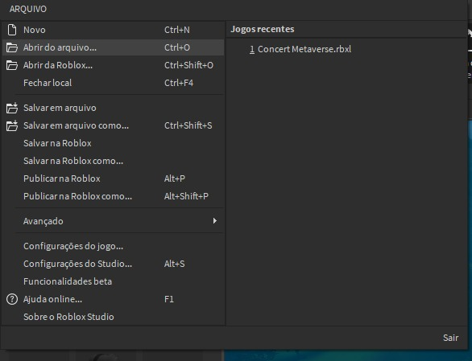
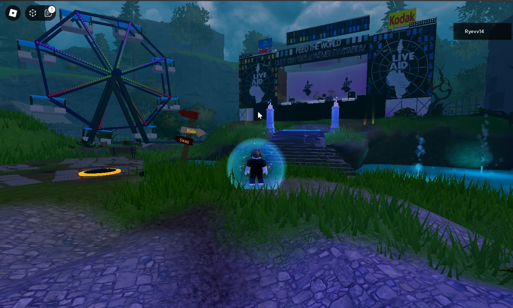
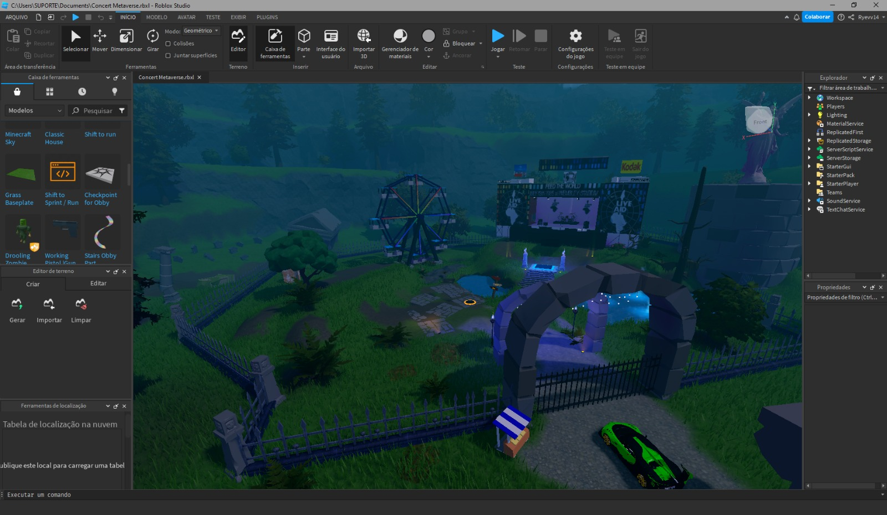
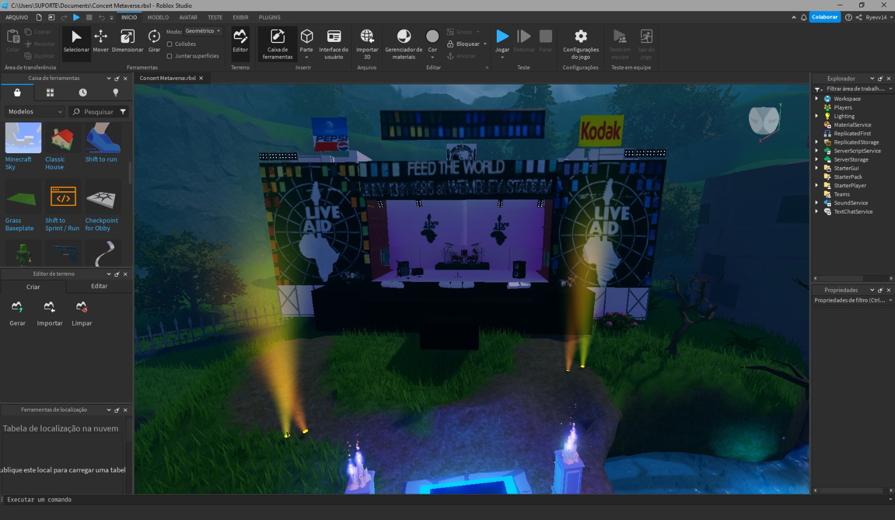
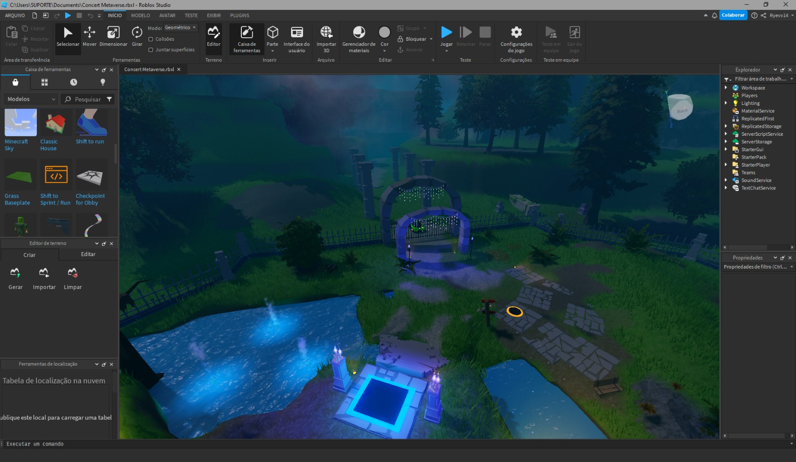
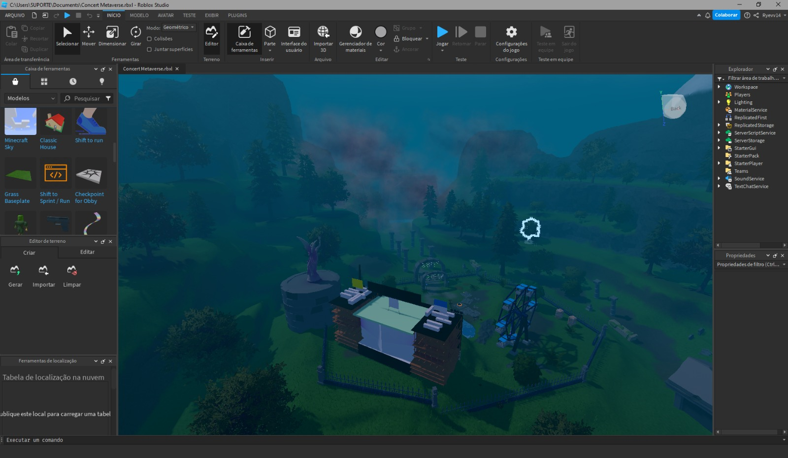

# Tópicos Integradores 

## Shows e Eventos no Metaverso

### Membros da Equipe

**BARBARAH EVELYN LIMA CAVALCANTI VIEIRA (01564427)** 
**EMERSON FERREIRA BEZERRA (01503639)** 
**GILBERTO PEREIRA DO NASCIMENTO JUNIOR (01474438)** 
**JOSÉ MÁRIO FELIX DO NASCIMENTO FILHO (01536752)** 
**LUCAS VIEIRA DA SILVA (01301103)** 
**MAGDIEL SANTOS SILVA (01566434)** 
**MÁRCIO ROBERTO LOPES DE FARIAS JÚNIOR (01529804)** 
**MARIANA MARIA DOS SANTOS RAMOS (01179459)** 
- **THIAGO CAVALCANTE MENDES DA SILVA (01505909)** 

## Como usar?

1. Baixe os seguintes [arquivos](https://github.com/lucasarieiv/topicos-integrados/tree/main/concert_metaverse):

- Concert Metaverse.rbxl
- Concert Metaverse.rbxl.lock

2. Abra o seu RobloxStudio

3. Escolha a opção "Abrir do arquivo..." ou `Ctrl+O`
4. Selecione o arquivo `ConcertMetaverse.rbxl`

## Escopo do projeto

